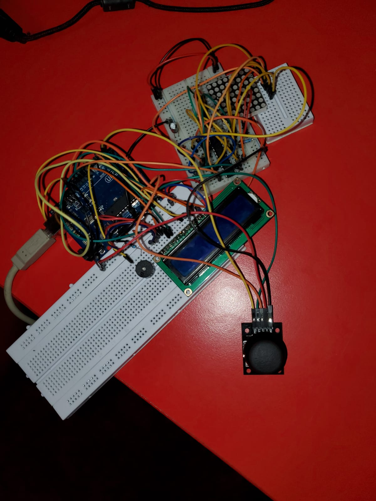
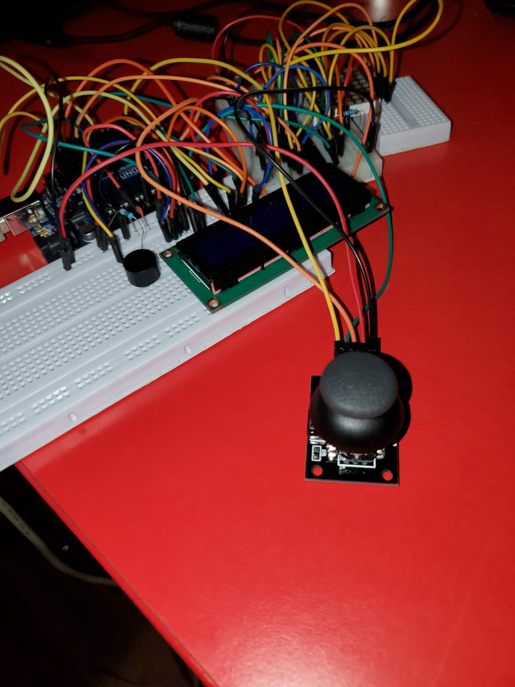

# Arcade shooter

## Backstory

I have decided to create this game since I have always loved shooters and I thought it would be a fun project to bring back childhood memories. At first I thought my idea was 100% original but then I found out that the guys that built Duke Nukem 1 did something similar (although my game is better).

## How to play

First of all, the menu. It is displayed on the LCD and you navigate through it with the joystick. There you can find some settings you can make to the game (e.g.: contrast, brightness, sound etc.), the highscores, an about section and the play button.

Then you have the game. Here you have to jump from platform to platform and kill all enemies by shooting them (by the way, they shoot back so be careful). The game comes up with 4 different difficulty levels: easy, medium, hard and insane. As the difficulty increases you have more enemies, they shoot faster and they have more life.

The goal of the game is to obtain a score as high as possible. You begin with a score of 255 that decreases as the game progresses (it decreases faster for easy and slower for insane so that you cannot have a higher score on easy than on insane).

## Used components

- LCD display
- 8x8 LED matrix
- MAX7219 driver
- buzzer
- joystick
- Arduino UNO board
- 1 capacitor
- 3 ceramic capacitors
- resistors as needed
- a ton of cables

## Setup

## Video

https://youtu.be/OFVaXMpCicw